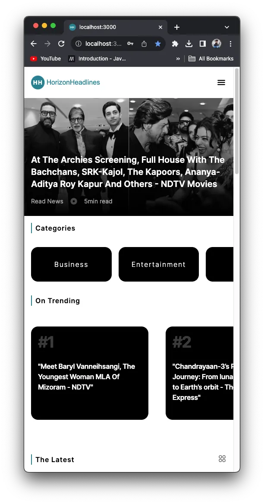
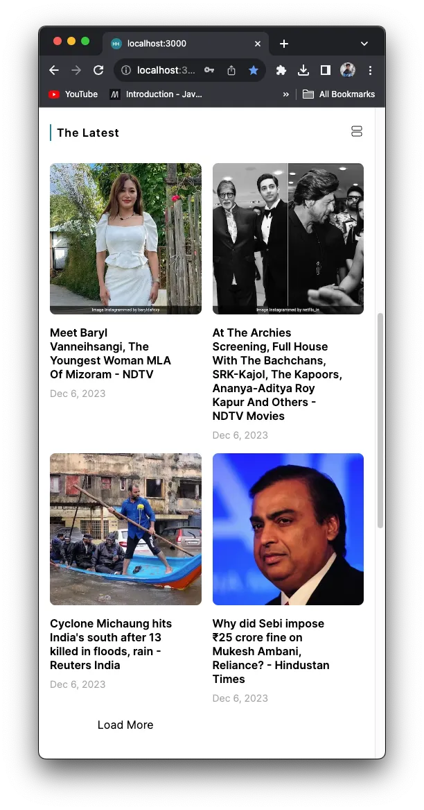
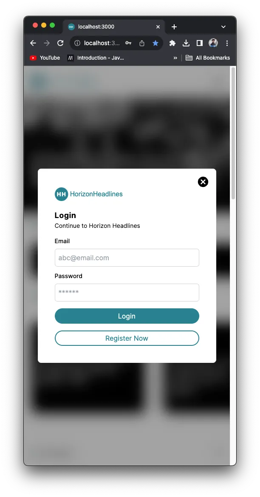
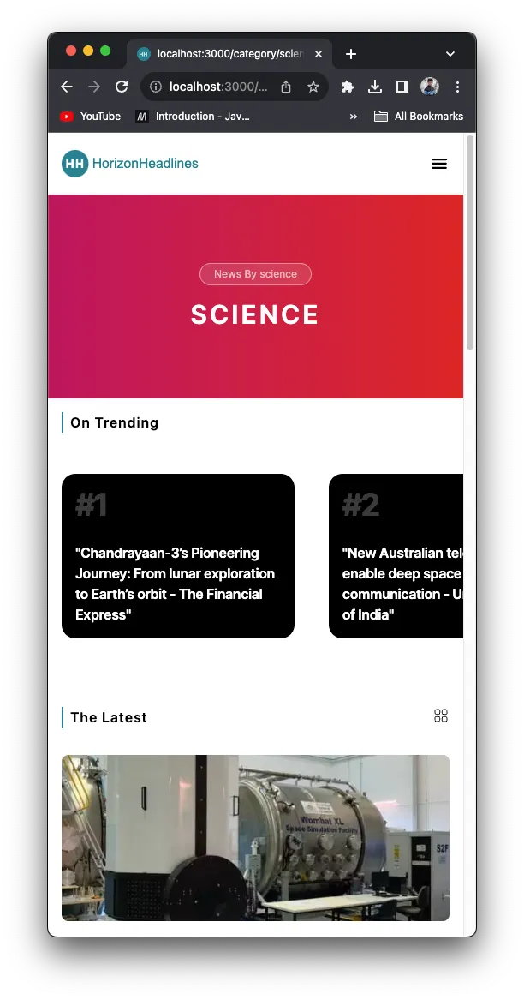
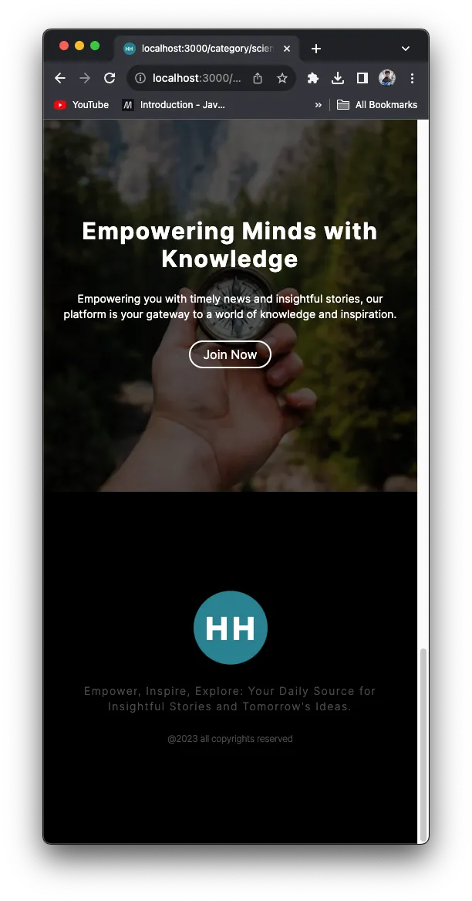

# Project Name: Horizon Headlines

# Horizon Headlines - Your Trusted Source for Timely Updates

**Brief Description:**

Horizon Headlines is a dynamic and user-friendly news web application that delivers the latest and most relevant news from around the world. With a clean and intuitive interface, Horizon Headlines aims to keep users informed and engaged with up-to-the-minute news articles on diverse topics.

## Key Features:

- **Comprehensive Coverage:** Stay informed with a wide range of news articles covering politics, technology, entertainment, health, and more.

- **Personalized Experience:** Customize your news feed by selecting your preferred topics, ensuring you get updates on the subjects that matter most to you.

- **Responsive Design:** Enjoy a seamless reading experience across devices, whether you're on your desktop, tablet, or mobile phone.

- **User-Friendly Interface:** Navigate through articles effortlessly with an easy-to-use interface designed for a smooth and enjoyable user experience.

## Screenshots

### Web View

#### Desktop - Home Page


#### Desktop - News List Page


#### Desktop - New Likes with login user


#### Desktop - In App Preview Page


#### Desktop - Login Page


#### Desktop - Register Page


#### Desktop - Category Page


### Mobile View

#### Mobile - Home Page

<div style="display: flex; justify-content: space-between;">
  
  
  
</div>

<div style="display: flex; justify-content: space-between;">
  
  
  
</div>

## Table of Contents (Optional)

- [Installation](#installation)
- [Thanks](#Thanks)

## Installation

### News API Key

1. **Obtain News API Key:**

   - Visit [News API website](https://newsapi.org/) and sign up for an account.
   - Obtain your News API key from the dashboard.

2. **Set Up Environment Variable:**
   - Create a file named `.env` in the root of your project.
   - Add the following line to the `.env` file:
     ```env
     NEXT_PUBLIC_NEWS_API_KEY=your_news_api_key
     ```
   - Replace `your_news_api_key` with the actual News API key.

### Firebase Configuration

1. **Set Up Firebase Project:**

   - Visit [Firebase Console](https://console.firebase.google.com/) and create a new project.
   - Enable Authentication and set up Firestore based on your project requirements.

2. **Get Firebase Configuration:**

   - In the Firebase Console, go to Project Settings > General.
   - Scroll down to "Your apps" and click on the web app (</> icon).
   - Copy the configuration object.

3. **Set Up Environment Variable:**
   - In the `.env` file, add the following lines:
     ```env
     NEXT_PUBLIC_FIREBASE_API_KEY=your_firebase_api_key
     NEXT_PUBLIC_FIREBASE_AUTH_DOMAIN=your_firebase_auth_domain
     NEXT_PUBLIC_FIREBASE_PROJECT_ID=your_firebase_project_id
     NEXT_PUBLIC_FIREBASE_STORAGE_BUCKET=your_firebase_storage_bucket
     NEXT_PUBLIC_FIREBASE_MESSAGING_SENDER_ID=your_firebase_messaging_sender_id
     NEXT_PUBLIC_FIREBASE_APP_ID=your_firebase_app_id
     ```
   - Replace `your_firebase_*` placeholders with the actual values from the Firebase configuration.

## Thanks

Thank you for checking out my project! I appreciate your interest.
